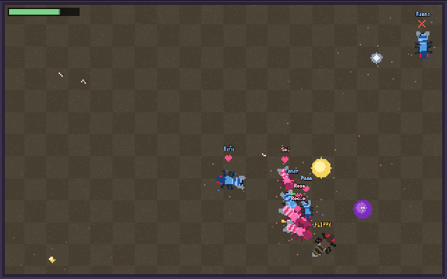
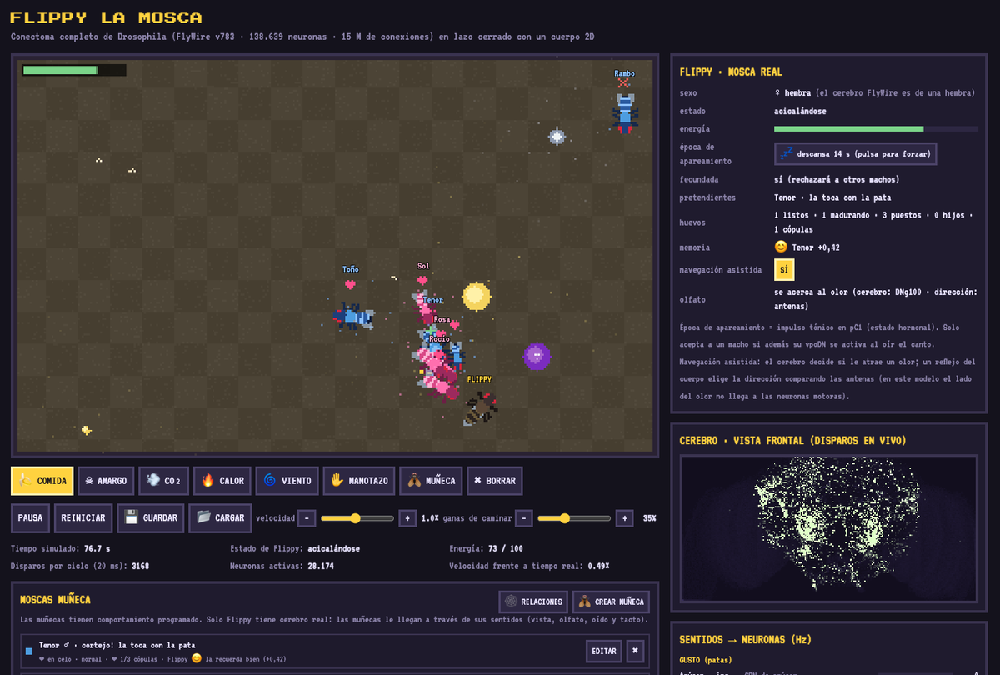
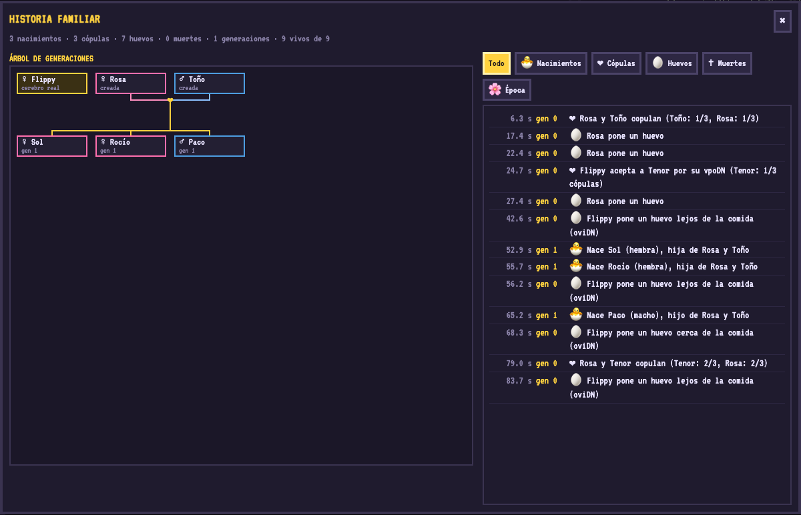
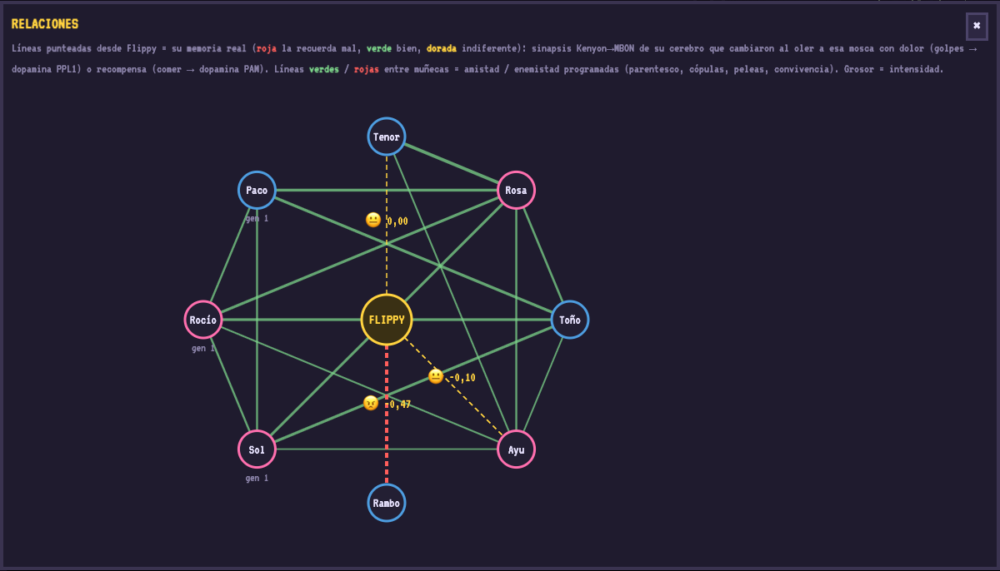

# 🪰 FLIPPY LA MOSCA

[Leer en español](README.md) · **English**

**A whole fruit-fly brain, running on your laptop and living in a pixel-art world.**

Flippy carries the real connectome of *Drosophila melanogaster* (FlyWire v783: **138,639 neurons and 15 million
connections**), simulated neuron by neuron. Whatever she sees, smells, hears, touches and tastes in the arena
drives her sensory neurons; whatever her motor neurons do moves her body. Nobody programmed her to eat, flee or
choose a mate: her connectome decides.



Runs on a **MacBook Air M1 with 8 GB** at ≈ real time (~1.5 GB of RAM).

> The game interface is in Spanish. Button names below are given in Spanish (as they appear on screen) with an
> English translation.

## Try it

**You need:** Python 3.10 or newer, ~2 GB of free RAM, ~500 MB of disk and an internet connection the first time
(to download the connectome). Tested on macOS (Apple Silicon); Linux and Windows should work but are untested.

### The easy way (macOS / Linux)
Double-click **`iniciar_flippy.command`** (on Linux: `./iniciar_flippy.command`). The first time it sets up a Python
environment inside the folder, installs what it needs and downloads the connectome (a few minutes); then it opens the
game in your browser. After that it opens straight away.
If macOS says it can't open it because it comes from an unidentified developer: right-click → **Open** → **Open**.

### From the terminal
macOS / Linux:
```bash
python3 -m venv .venv              # own environment (avoids the "externally-managed-environment" error)
source .venv/bin/activate
pip install -r requirements.txt    # numpy, pandas, pyarrow, numba
python download_data.py            # ~135 MB of connectome, once
python server.py                   # opens http://localhost:8000
```
Windows (PowerShell):
```powershell
py -m venv .venv
.venv\Scripts\activate
pip install -r requirements.txt
python download_data.py
python server.py
```
Next time, just activate the environment (`source .venv/bin/activate`) and run `python server.py`.

### Options
- On start-up, `server.py` shows a **connectome menu**: the ones you have and others you can download
  (FlyWire v630, Hemibrain, MANC, BANC, Male CNS). Only FlyWire v783 runs in the game today; the others are stored
  in `data/models/` to be made compatible later. Enter = play.
- `python server.py --no-menu` goes straight in · `--port 8080` uses another port · `--no-browser` doesn't open the browser.
- `python download_data.py --list` lists the catalogue; `python download_data.py manc121` downloads one without the game.
- `python -m flippy.selftest` checks in ~20 s that the brain reproduces the key results (9 tests).

### Quit and save
- The **⏻ GUARDAR Y APAGAR** *(save & quit)* button in the page, or **Ctrl+C** in the terminal: both save first.
- The game **autosaves** every minute; when you reopen it, it offers **▶ CONTINUAR** *(continue)*. You can also save
  and load named games (💾 / 📂). Saved games live in the `saves/` folder.

## Interface guide

- **Arena:** pick a tool and click the arena to place it: 🍌 food, ☠ bitter, 💨 CO₂, 🔥 heat, 🌀 wind, 💡 light,
  🪨 stone, 🍂 leaf, ✋ hand swat, 🪰 doll fly (opens a window to set it up) and ✖ erase.
- **Controls:** pause, restart, save/load, ⏻ save & quit, 🌙 day/night cycle, arena size, simulation **speed** and the
  body's **urge to walk** (*ganas de caminar*: − stays put, + walks more).
- **Flippy's card** (right): her state, energy, **mating season** (*época de apareamiento* — switch it on so she
  accepts males) and **assisted navigation** (*navegación asistida* — switch it off to see 100 % brain behaviour).
- **PANELES** *(panels)* — floating windows you can drag; they remember their position and close with ✖ or Esc:
  🪰 Flippy in detail · 🧪 Experiment: silence neurons · 🧭 Flippy's memory · 👁 What Flippy sees ·
  🧠 Brain (live spikes) · 📶 Senses → neurons · ⚡ Commands to the body. Each button shows a live summary.
- **Moscas muñeca** *(doll flies, bottom)*: the list, **🕸 RELACIONES** *(relationships: social graph and Flippy's
  memories)* and **EDITAR** *(edit)* for each one.
- **Árbol familiar** *(family tree, bottom)*: the **📜 HISTORIA** *(history)* button shows the full timeline and lets you
  follow one particular fly.



## What you can do

| Tool | What happens in Flippy's brain |
|---|---|
| 🍌 Food | she smells fruit (ORN DM1/DM4…) → approaches; on contact, her sugar neurons drive **MN9** and she extends her proboscis to eat |
| ✋ Hand swat | an expanding shadow drives **LC4/LPLC2** → **giant fiber (DNp01)** → she takes off to escape |
| 💨 CO₂ · 🔥 Heat | drive **DNb05** → she moves away; heat is also a punishment she remembers |
| ☠ Bitter | drives her bitter taste neurons (legs); in this model it barely reaches the motor commands |
| 🌀 Wind | drives Johnston's organ (antennae); it shows in her senses but doesn't change her behaviour in this model |
| 🪨 Stone | an approaching obstacle drives **LPLC1** of that eye → the brain turns the other way (with LPLC1 she spends 64 % less time bumping into things) |
| 🍂 Leaf | shady shelter: flies sleep under it and vision is dimmed |
| 💡 Light | the **ocelli** drive **DNp18** (more light, more spikes) → she walks toward the brighter eye (assisted) |
| 🪰 Doll fly | configurable companions (sex, mating season, violence, helper, sociable, song, persistence…) |

Doll flies have scripted behaviour; only Flippy has a brain. They reach her only through her senses:

| The doll… | Flippy's sense | Neurons | Connectome response |
|---|---|---|---|
| is in view | left/right eye | LC10a / LC11 | she turns toward it (DNa02 on that side) |
| lunges fast | expanding shadow | LC4 / LPLC2 | giant-fiber escape (DNp01) |
| touches her | antennae | mechanoreceptors | she grooms (DNg84) |
| is nearby | its individual odour | 10 glomeruli → Kenyon cells | she remembers it (see *Real memory*) |
| is male | cVA pheromone | ORN DA1 (Or67d) | |
| sings (male in season) | courtship song | JO-B + vpoEN\* | if she is in season (pC1) → vpoDN → she accepts |

### Graded startle, sleep and shelter
- **Graded escape with habituation:** a strong giant-fiber (DNp01) volley makes her take off; a milder alarm
  (DNp02/04/11) only makes her walk away. Every take-off raises the threshold (habituation), which recovers after
  ~20 s of calm. Flies discount their own motion: only things approaching *them* are scary.
- **🌙 Day and night** (2.5 min + 1.5 min): at night flies sleep, preferably under a **🍂 leaf**. Asleep, her senses
  are attenuated (high arousal threshold); the giant fiber, the alarm, touch or dawn wake her. Under a leaf her vision
  is shaded. Memory doesn't fade during sleep (consolidation). Sleep is an internal state: the connectome doesn't
  generate it, but what wakes her does come from it.

### Space
Three arena sizes (small 320×200, medium 480×300, large 640×400), switchable at any time. The maximum population
depends on the area (~1 fly per 6,400 px²: 10 / 22 / 40). Touch is phasic, like real mechanoreceptors: a bump is felt
in full, sustained contact (walking along a wall) adapts within ~0.6 s; doll flies keep a personal space around Flippy.

### 👁 What Flippy sees
A window shows her ~300° first-person panorama (floor in perspective, walls, stones, flies, food, light and the
approaching hand) and which detector neurons fire in each eye. Her brain doesn't receive that picture pixel by pixel,
but through her detectors: LC4/LPLC2 (something approaching), LC10a/LC11 (another fly), LPLC1 (obstacle) and the
ocelli (light). Tested and discarded for now: HS/VS cells (sensing her own rotation) and R1-6 photoreceptors don't
reach the walking commands in this model.

**Finding: vision from the photoreceptors doesn't work in this model.** We projected an expanding shadow onto the
~4,000 R1-6 photoreceptors of one eye, placed at their real positions (their retinotopic layout is reconstructed from
the anatomy: almost a plane). Result: the signal dies in the medulla. With bright light 20 % of the lamina (L1-L3) and
4 % of the Tm cells fire, but nothing reaches T4/T5 (motion), LC4/LPLC2 (threats) or the giant fiber — neither with
the model as is nor after correcting the photoreceptor sign (FlyWire predicts them cholinergic; in reality they
release histamine, which is inhibitory). The cause is fundamental: the first retinal layers use graded potentials,
detect darkness by disinhibition and compute motion with fine delays, which a spiking model with a single synapse
type does not reproduce. The work that does achieve it (Lappalainen et al. 2024, *Nature*) trains the parameters of
each cell type. That's why Flippy's vision enters through her detectors (LC4, LPLC2, LC10a, LC11, LPLC1, ocelli):
from there on, everything is connectome.

### Courtship: Flippy chooses
Males follow the real ritual: orient → tap her → **sing with one wing** → attempt copulation. The decision belongs to
the connectome: **vpoDN** (accept) versus **DNp13** (reject by extruding the ovipositor). Measured in the model: more
song → more vpoDN (4 → 13 Hz), so a good singer convinces her sooner; without the pC1 drive (mated or out of season)
song drives DNp13 instead, as in Wang et al. 2021. If two males court at once, they fight. A male approaching too fast
triggers Flippy's giant fiber: good courtship is slow.

### Offspring and family tree
After mating, eggs mature and Flippy lays them when her **oviDN** decides. Sugar and food odour slow it down
(−20 % / −35 %), the same direction as Yang et al. 2008 (females avoid laying on sucrose). Egg → larva (looks for
food) → pupa → adult → old age, in ~3 minutes; offspring inherit a mix of their parents' traits and odour. After
mating, each fly rests for one generation; doll flies die after their third mating. Dolls also breed among
themselves, so generations appear, with a **family tree and timeline**.



### Real memory
Every fly has an **individual odour** (10 glomeruli) that activates ~1 % of the 5,177 Kenyon cells, with little
overlap between flies. The 62,261 Kenyon→MBON synapses are **plastic** (rule of Hige et al. 2015): active Kenyon cell
+ dopamine in its compartment → the synapse weakens; smelling without dopamine → slow extinction. Which dopamine
neurons innervate each MBON is read from the connectome and matches the map of Aso et al. 2014.
- A blow → pain → **PPL1** dopamine → weakens the "approach" MBONs for that odour → she avoids it.
- Eating with someone nearby → **PAM** dopamine → weakens the "avoid" MBONs → she approaches.

Conditioning in the model: odour + pain → −1.00; odour alone → +0.07; odour + reward → +1.00. Memory is saved with
the game.

**Place memory** with the same mechanism: every leaf, food patch and hot spot has its own odour. Eating somewhere →
she likes it; getting hot → she avoids it (heat is a punishment, PPL1); sleeping peacefully under a leaf → "relief"
(PAM) → she prefers it. Measured: after eating at a feeder, when hungry she returns to it from 358 px away, beyond the
reach of its odour (without that experience, she doesn't); after sleeping well under a leaf, the next night she
sleeps there even if another leaf is closer. The **🧭 MEMORIA DE FLIPPY** *(Flippy's memory)* window shows a
mini-map, lists and what she has been learning.



## 🧪 Experiment mode: silence neurons

Like in a lab: silenced neurons **cannot fire** (the equivalent of optogenetic inhibition with GtACR1 or expressing
the Kir2.1 channel), so everything that depended on them loses their input. **🧪 EXPERIMENTO** window in PANELES:

1. **By function:** a documented catalogue; each button explains what it is, where it is, what will happen and the
   reference.
2. **By clicking the brain map** (front view): switches off an area, like a laser. Hovering shows a tooltip with how
   many neurons are underneath, which regions, the main cell types explained and which game functions would be
   affected. Clicking a silenced area restores it.
3. **Silenced now:** a list to restore them one by one or all at once. Silenced areas show in red in the brain
   window. Experiments are saved with the game and logged in the timeline.

| Function | Where | If you silence it | Reference |
|---|---|---|---|
| Giant fiber | brain → ventral nerve cord (2 neurons) | Faced with a threat she no longer takes off; at most she walks away (alarm neurons). | von Reyn et al. 2014 |
| Eating (MN9) | subesophageal zone (7 neurons) | Even standing on food with her sugar neurons firing, she doesn't eat and her energy drops. | Shiu et al. 2024 |
| Turning (DNa01/DNa02) | descending (4 neurons) | She stops turning by her brain's decision: no following flies or avoiding obstacles. | Rayshubskiy et al. 2020 |
| Threat detection (LC4/LPLC2) | optic lobe → brain (~310) | "Blind" to threats: a hand swat no longer scares her. | Ache et al. 2019 |
| Obstacle avoidance (LPLC1) | optic lobe → brain (~140) | She bumps into stones and walls more. | Tanaka & Clark 2022 |
| Seeing other flies (LC10a/LC11) | optic lobe → brain (~360) | She no longer turns toward the flies she sees. | Ribeiro et al. 2018 |
| Memory (Kenyon cells) | mushroom body (5,177) | She learns nothing new and can't use what she remembered (doesn't recognise odours). | Heisenberg 2003 |
| Learning punishment (PPL1 dopamine) | mushroom body (16) | Stops learning from blows and heat; still learns good things. | Aso et al. 2014 |
| Learning reward (PAM dopamine) | mushroom body (~300) | Stops learning good things (feeders, favourite leaves); still learns punishment. | Aso et al. 2014 |
| Accepting a mate (vpoDN) | descending (2 neurons) | She never accepts a male, even in season and with great song. | Wang et al. 2021 |
| Rejecting (DNp13) | descending (2 neurons) | She can no longer reject with the ovipositor. | Wang et al. 2021 |
| Sexual drive (pC1) | protocerebrum (10 neurons) | Even in mating season she doesn't become receptive. | Zhou et al. 2014 |
| Egg laying (oviDN) | descending (6 neurons) | Eggs mature but she doesn't lay them. | Wang et al. 2020 |
| Grooming (DNg84) | descending (2 neurons) | She no longer grooms when touched. | Hampel et al. 2015 |
| Odour attraction (DNg100/DNge053) | descending (4 neurons) | Food odour stops attracting her (she finds it only by chance). | this project |
| Smelling fruit (ORN) | antennae (~170 neurons) | Anosmic to food: she can't smell it. | Semmelhack & Wang 2009 |
| Sensing light (ocelli) | ocelli → brain (20) | The lamp stops attracting her. | Hengstenberg 1993 |
| Olfactory brake (GABA interneurons) | antennal lobe (~150) | Measured in this model: olfactory projection neurons respond 20-30 % more strongly to the same odour (less contrast between odours). It does not cause a seizure. | Olsen & Wilson 2008 |

Verified in the model: without MN9 she doesn't eat even on food (energy −3 vs +38 in 5 s); without the giant fiber a
hand swat doesn't make her take off; without Kenyon cells she stops recognising whoever she remembered; without the
antennal-lobe GABA brake her olfactory projection neurons respond 20-30 % more to the same odour.

## What is brain and what isn't

**From the connectome:** eating (MN9), escaping (DNp01), grooming (DNg84), turning toward another fly, accepting or
rejecting (vpoDN / DNp13), when to lay eggs (oviDN), what memory learns (Kenyon→MBON).

**Added or assisted** (marked in the interface):
- **Assisted navigation** (toggle): in this model the *side* an odour comes from doesn't reach the descending neurons
  (measured: DNa01/02 fire the same with odour on the left or on the right). The brain decides *whether* an odour, a
  fly or a memory attracts her; a body reflex chooses *which way*. With assisted smell she reaches food 8/8 times in
  ~2.4 s; without smell, 1/8 in 17 s. Switch it off to see 100 % brain behaviour.
- **Internal states as stimuli:** mating season (pC1), mature eggs (SMP550), pain (PPL1) and reward (PAM). In a real
  fly these arrive through hormones or the ventral nerve cord, which this connectome doesn't include.
- \***Song shortcut:** courtship song also drives vpoEN; the temporal filter for the song pulse isn't reproduced with
  fixed weights (song alone never reaches vpoEN in simulation).
- **Urge to walk:** the connectome doesn't generate spontaneous walking; the body walks and the brain modulates it.
- The memory "opinion" is computed from the current synapses (the input the MBONs would receive); the change in MBON
  firing is small because each odour activates few Kenyon cells.

**Changes to the original model by Shiu et al.:**
- Antennal-lobe local interneurons with a *predicted* dopamine/serotonin transmitter are really GABAergic: without
  this fix, any odour or heat set off a "seizure" of ~10,000 saturated neurons.
- Spike-frequency adaptation (`a_inc=0.5`, `tau_a=300 ms`), so the circuit doesn't get stuck in self-sustained states.
- Neurons within 0.2 mV of rest are not integrated (identical results in the tests, much faster).

## How it works

| File | |
|---|---|
| `flippy/brain.py` | LIF model of Shiu et al. 2024, *event-driven* (only integrates neurons away from rest) and compiled with numba; falls back to numpy without it |
| `flippy/neurons.py` | Which FlyWire cell types are senses and which are read out as motor commands. Edit it to rewire the body |
| `flippy/memory.py` | Dopaminergic plasticity of the mushroom body |
| `flippy/world.py` | Arena, body, reproduction, genealogy, saving |
| `flippy/dolls.py` | Doll flies: traits, courtship, relationships |
| `flippy/experiments.py` | Documented catalogue for experiment mode (silencing neurons) |
| `flippy/catalog.py` | Catalogue of downloadable connectomes (start-up menu) |
| `flippy/selftest.py` | Tests of the key results |
| `server.py`, `web/index.html` | Server (Python standard library only) and interface |
| `download_data.py` | Connectome download |
| `iniciar_flippy.command` | Double-click launcher (macOS/Linux) |

Each tick (20 ms of brain time): world → sensory rates (Poisson) → 100 steps of 0.2 ms over all 138,639 neurons →
descending neurons → body.

## Troubleshooting

- **"El puerto 8000 está ocupado"** *(port 8000 is busy)*: a FLIPPY is already running (quit it with its ⏻ button),
  or use `--port 8001`.
- **"externally-managed-environment" when installing**: use your own environment (`python3 -m venv .venv`, see above).
- **macOS won't open `iniciar_flippy.command`**: right-click → Open → Open.
- **It's slow**: the simulation uses one CPU core; with many dolls crowding Flippy it drops to ~0.7× real time.
  Closing the 🧠 Brain window and using fewer dolls helps.
- **Start from scratch**: the REINICIAR *(restart)* button (the autosave is overwritten within a minute), or delete
  the `saves/` folder.
- **Redo the installation**: delete the `.venv/` folder (and `data/` if you want to download the data again).

## Credits and citations

- **LIF model:** Shiu, P. K. et al. (2024). *A Drosophila computational brain model reveals sensorimotor
  processing.* Nature. Code and connectivity: [philshiu/Drosophila_brain_model](https://github.com/philshiu/Drosophila_brain_model) (MIT).
- **FlyWire connectome:** Dorkenwald, S. et al. (2024). *Neuronal wiring diagram of an adult brain.* Nature.
- **Cell types:** Schlegel, P. et al. (2024). *Whole-brain annotation and multi-connectome cell typing of
  Drosophila.* Nature. [flyconnectome/flywire_annotations](https://github.com/flyconnectome/flywire_annotations)
  (for versions ≥ 3.0 they also ask to cite Matsliah et al. 2024 and Berg et al. 2025).
- Plasticity: Hige, T. et al. (2015), *Neuron*. Mushroom-body compartments: Aso, Y. et al. (2014), *eLife*.
- Sexual receptivity: Wang, F. et al. (2021), *Neuron*. Egg-laying site choice: Yang, C. et al. (2008), *Science*.

The code of this project is MIT (see `LICENSE`). The connectome data belongs to its authors: check FlyWire's terms of
use before redistributing it.
